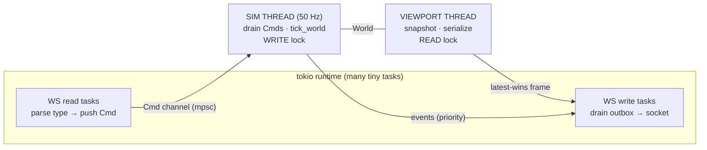

# HIVE — Architecture & the Clever Bits

A plain-language tour for an engineer new to the project. If `CLAUDE.md` is the reference manual,
this is the "why it's built like this" companion. Read it once and the codebase stops being surprising.

---

## What HIVE is, in one breath

A **planet-scale multiplayer Langton's-ant territory war**. Every player drops a **queen** somewhere
on an Earth-sized grid and releases **ant** workers that crawl around painting territory by the
classic Langton's-ant rule. Ants besiege rival queens; queens grow as they thrive and forfeit
everything when they die. The whole planet is one shared canvas, streamed live to every browser.

The twist that makes it interesting to *build*: the world is **1,500,000 × 750,000 tiles** (~1.1
trillion cells, Earth's circumference at ~26.7 m/tile), the target load is **~1,000 queens and
100,000 ants painting at once**, and it all has to feel smooth in a browser. That tension — a planet
of cells, a 20 ms tick budget, a single box — drives every interesting decision below.

---

## The tech stack, and why each piece

| Piece | What it does | Why it was chosen |
|---|---|---|
| **Rust** | the whole engine | One binary, no GC pauses to jitter the tick, fearless parallelism for the ant simulation. Replaced an earlier Node.js prototype that couldn't hold the tick at scale. |
| **tokio** | async HTTP + WebSocket runtime | Thousands of idle socket connections cost almost nothing; the WS read/write tasks are tiny async loops. |
| **axum** | web framework | Thin layer over tokio/hyper. One route (`/`) serves the client *and* upgrades to WebSocket; plus `/health` + `/world-info`, the `/api/*` auth/session routes, and `/egress-stats`. |
| **rayon** | data parallelism | The ant move-plan and every per-client viewport serialize in parallel with a single `par_iter`. This is what makes 100k ants and many viewports fit the budget. |
| **rustc-hash (FxHashMap)** | the maps for players/queens/tile-chunks | A fast non-cryptographic hash — these maps are hit millions of times per second; `SipHash` would be wasteful here. |
| **serde / serde_json + base64** | the wire format | Messages are JSON; the bulky tile payloads are a base64-encoded little-endian `u16` blob *inside* the JSON, which is far smaller than a JSON array of numbers. |
| **No database** | — | The world is too hot and too big for per-tile DB round-trips. Everything lives in RAM; the design instead makes RAM cheap (see the TileMap). State is still **durable**: a periodic gzip-JSON `world.snapshot` + `users.json` are autosaved (~60 s and on shutdown) and restored on boot (`persist.rs`) — no DB, but no data loss across restarts. |

The client is one self-contained `public/client.html` (HTML + canvas + JS), compiled *into* the
binary via `include_str!`. There's no separate front-end build — but editing it means recompiling.

---

## Queens and ants, approachably

```
        QUEEN (a base)                         ANT (a Langton cursor)
   ┌───────────────────┐               every tick it reads the tile it's on:
   │  ▓▓  level 1 = 2×2 │
   │  ▓▓  grows to 8×8  │      unclaimed → paint it MINE, turn LEFT
   │  has HP, a "bubble"│      my tile   → erase it,      turn RIGHT
   │  forfeits ALL its  │      enemy tile→ overwrite it,  go STRAIGHT
   │  land when it dies │
   └───────────────────┘      ...then step forward one cell.
```

- A **queen** is a player's home base and objective: an HP-bearing square footprint that grows with
  level. You can only deploy ants inside its "bubble" or onto land you already own. Kill an enemy
  queen and its entire territory turns blank.
- An **ant** is a [Langton's ant](https://en.wikipedia.org/wiki/Langton%27s_ant) — a tiny state
  machine that produces surprisingly organic, highway-building territory growth from three trivial
  rules. A **brute** variant is a 2×2, moves at half speed, never erases its own tiles, and deals 3×
  damage — a siege unit.

Both are plain structs in memory (`Ant`, `Queen` in `world.rs`), keyed by a numeric player id.
There is no per-entity object graph, no ECS — just `Vec<Ant>` and two `FxHashMap`s.

---

## How a pixel placement flows, end to end

This is the spine of the whole system. Follow one ant placement from a click to everyone's screen:

```
  Player A's browser                  Server (one process)                 Everyone's browser
  ──────────────────                  ────────────────────                 ──────────────────
  click + drag a tile
  send({t:'place-ant',                ┌─ WS read task (tokio) ─┐
        x,y,dx,dy})  ───WebSocket───▶ │ parse only the *type*, │
                                      │ push a Cmd onto a       │   (never locks the World)
                                      │ channel                 │
                                      └───────────┬─────────────┘
                                                  ▼
                                      ┌─ SIM THREAD (50 Hz) ────┐
                                      │ drain all Cmds:          │
                                      │  validate_worker_place.. │  bubble? on land? on a queen?
                                      │  push Ant into Vec<Ant>  │
                                      │ tick_world():            │
                                      │  • plan moves (parallel) │
                                      │  • paint via tiles.set() │  ← the pixel actually changes here
                                      │  • clashes, damage, …    │
                                      └───────────┬─────────────┘
                                                  ▼  (no lock held)
                                      ┌─ VIEWPORT THREAD ───────┐
                                      │ for each client, in      │
                                      │ parallel (rayon):        │
                                      │  snapshot their rect →    │
                                      │  fog + base64 tiles →     │ ───WebSocket───▶  decode & blit
                                      │  push latest frame        │                   onto canvas
                                      └─────────────────────────┘
```

The key idea: **the socket tasks never touch the world.** They translate bytes to a `Cmd` and move
on. Exactly one place mutates the world (the sim thread, while it holds the write lock), and exactly
one place reads it for rendering (the viewport thread, under a short read lock). That single rule
removes whole categories of race conditions before they can exist.

---

## The genuinely clever parts

### 1. Three threads, one world, and a strict ownership rule

Everything shares one `World` behind `Arc<RwLock<World>>`, split across three roles:



Why it's clever: the sim thread is **pure tick** — it never serializes a frame, so its cadence
doesn't wobble when a big tile update needs encoding. Steady cadence is what lets the *client*
smoothly interpolate ant motion between frames. Each connection even has **two** outbound channels —
a priority queue for events/confirmations and a **latest-wins `watch` slot** for viewports — merged
with a `biased` `select!`, so a slow network drops stale frames instead of backlogging, and never
delays an important event.

### 2. The TileMap: RAM that scales with *perimeter*, not area

A painted planet is the memory wall. ~100 billion colored cells stored naively as 4-byte ids is
hundreds of GB. The trick (`tile_map.rs`):

- The world is a sparse map of **256×256 chunks**; ocean/empty chunks simply don't exist.
- A solid chunk (all one owner) collapses to **`Uniform(idx)`** — a couple of bytes for 65,536 cells.
  Only **frontiers** (mixed chunks) pay a **`Dense`** array.
- Cells are **`u16` palette indices**, not raw ids: `palette[idx] → player_id`, and an index is
  **recycled the instant an owner's tile count hits zero**. So the live index space is bounded by the
  number of *concurrently painting* owners (a few hundred), never the lifetime id count — `u16` is
  safe even across a season of tens of thousands of accounts.

The upshot: a solidly-held continent costs almost nothing; you only pay for the wiggly *edges* where
ants are actively fighting. A periodic `compact_pass` re-collapses chunks that became solid via
clash conversions. Every mutation goes through `tiles.set()`, which keeps an exact per-player count
in sync and drops empty chunks — so leaderboards and scoring are O(1) lookups, never a scan.

### 3. Lock-free, parallel viewport serialization

Rendering N clients means N fog fields + N base64 blobs per frame — the heavy part. So it's split
(`network.rs`):

- **`snapshot_view`** runs *under* the read lock and only copies the minimal owned data for a client
  (their rect of tile ids, the visible ants/queens). Cheap.
- **`finish_view`** runs with **no lock held**, in parallel across clients via rayon: it computes
  fog, base64-encodes the tiles, and builds the JSON.

Because the expensive work is outside the lock and off the sim thread, a heavy frame can never stall
a tick. (This relies on one deliberate `unsafe impl Sync for TileMap` — sound because the parallel
phase only ever *reads* tiles; there's no interior mutability. It's commented as load-bearing, and it
is.)

### 4. Fog of war as a two-pass distance transform

Each player sees only near their own territory. Rather than per-cell visibility checks, fog is a
**Chebyshev distance transform** (`fog.rs`): seed every owned cell at distance 0, sweep top-left→
bottom-right then bottom-right→top-left, and you have the distance from every visible cell to the
nearest owned tile in two linear passes. Map distance → a 0–100 fog value. It runs on a *padded
slice* (not the live world) precisely so it can execute off-thread, unlocked.

### 5. The LOD territory pyramid (zoom out without dying)

If a client zooms out to see a continent, the naive tile rect could be millions of cells. Instead,
when the requested span exceeds `MAX_DIM` (800), `snapshot_view` **nearest-samples** one tile every
`step` tiles into a ≤800×800 grid, tags the frame with its `lod` step, and suppresses sub-pixel ants.
The client blits that downsampled grid scaled up. So the wire payload for "show me the whole planet"
is bounded to ~640 KB no matter the zoom — an on-demand image pyramid computed per request.

### 6. Spatial bucketing for queen collisions

Queen-vs-queen overlap was an all-pairs O(queens²) scan every tick — ~1M map lookups at 1,000
queens, run even when nobody overlaps. Since two queens can only touch within ~9 tiles,
`resolve_queen_collisions` buckets queens into a 16-tile grid and only compares same/adjacent cells —
~O(queens). Isolated cost dropped from **~2,400 µs to ~90 µs per tick** (≈26×), and the win compounds
at higher counts (O(n²) quadruples at 2k queens; bucketing stays flat).

### 7. The grid *is* the Earth

Tiles map to lat/lon by a **Mercator projection** centered at a configurable capitol. The same math
lives on both sides: the server (`regions.rs`) uses it to tag each tile's country/metro via
point-in-polygon over Natural Earth data (for the Discovery feature and region leaderboards), and the
client (`drawOsmTiles`) uses it to draw **OpenStreetMap raster tiles directly under the live camera**.
The OSM basemap tracks panning/zooming in real time and is independent of the server viewport — the
server only sends the *territory/ant/queen overlay*. Real cities become real battlegrounds for free.

---

## A mental model to keep

> One process. One world in RAM. The **sim thread** is the only writer and ticks like a metronome;
> the **viewport thread** is a reader that fans out frames in parallel; **tokio** just shuttles bytes.
> Memory is cheap because solid territory compacts to nothing and only edges cost anything. Scale is
> survived by bounding every payload (LOD) and avoiding every O(n²) (bucketing, sorted-pair passes,
> O(1) counts).

## Where to go next

- **`CLAUDE.md`** — the reference: file-by-file map, the full WebSocket message protocol, the key
  invariants you must preserve, and **Performance & scaling** (targets, benchmarks, known limits).
- **`src/simulation.rs`** — `tick_world` is the heart; its 11 phases read top-to-bottom like a recipe.
- **`src/tile_map.rs`** — start here to understand the memory story; the unit tests double as docs.
